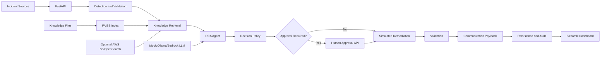

# Agentic Support Framework

Agentic AI Operations and Production Support platform for incident ingestion,
root-cause analysis, RAG-assisted investigation, human-in-the-loop approval, and
safe remediation simulation in Python.

## 1. Overview

Agentic Support Framework is a reference implementation for building AI-assisted
incident management workflows. It combines FastAPI, Streamlit, agent
orchestration, local RAG with FAISS, log anomaly detection, and optional AWS
reference integrations.

The project is intended for developers, SREs, platform engineers, architects,
researchers, and recruiters who want to understand how an agentic incident
workflow can be structured. It is currently an MVP/reference implementation, not
a drop-in production remediation system.

By default, the project runs in local mock mode. This keeps setup simple and
prevents accidental calls to cloud services or live remediation targets.

## 2. Problem Statement

Production support teams often deal with repeated incidents, fragmented
runbooks, noisy alerts, manual triage, slow RCA, and risky remediation decisions.
This project explores how agentic workflows can help operators:

- Normalize incident context from alerts, logs, and sample payloads.
- Retrieve relevant runbooks and previous incident knowledge.
- Generate structured AI-assisted RCA and remediation plans.
- Apply decision policies before taking action.
- Route higher-risk incidents to human approval.
- Preserve incident history and audit context for later review.

The repository does not claim production performance improvements. It provides a
working foundation for experimentation and extension.

## 3. What the Platform Does

The current implementation supports two related incident workflows:

- A versioned FastAPI agent pipeline under `/api/v1`.
- An AI Ops MVP workflow under unversioned `/incidents/...` and `/knowledge/...`
  endpoints.

The system can receive incident payloads, classify severity, retrieve knowledge,
generate mock or LLM-backed RCA, evaluate decision rules, request approval,
simulate remediation, validate outcomes, prepare communication payloads, and
persist selected runtime state locally or through optional adapters.

## 4. Key Capabilities

- FastAPI API for incident analysis, approval, RAG search, RAG rebuild, health,
  and dashboard telemetry.
- Streamlit operator dashboard backed by runtime API responses.
- Agent pipeline for detection, RCA, decisioning, remediation planning,
  validation, and communication payload generation.
- LangGraph-style MVP workflow with fallback graph execution when LangGraph is
  unavailable.
- Local FAISS vector index over Markdown, text, PSV knowledge files, and sample
  incident history.
- Default embedding model: `all-MiniLM-L6-v2`, with offline TF-IDF fallback.
- Mock LLM provider for safe local demos and tests.
- Ollama provider for local live LLM calls when `APP_MODE=live`.
- Optional AWS reference path for Bedrock, S3, OpenSearch, DynamoDB, and Lambda.
- Log parsers and watchers for Magento, AEM, Java, and Python log formats.
- Human approval endpoints and approval-state transitions.
- Simulated remediation and generated communication/report objects.

## 5. Current Implementation Status

| Capability | Status | Notes |
|---|---|---|
| Incident ingestion | Implemented | `POST /api/v1/incidents/analyze` and `POST /incidents/trigger` accept structured payloads. |
| Sample incident execution | Implemented | `scripts/simulate_incident.py` posts sample payloads to `/incidents/trigger`. |
| Log monitoring | Partial | File watchers and parsers exist for Magento, AEM, Java, and Python. They require configured local log paths. |
| Dashboard | Implemented | Streamlit UI in `ui/dashboard.py` reads API health and dashboard telemetry. |
| LLM summary/RCA | Mocked by default, partial live support | Mock provider is default. Ollama is implemented for live local calls. Bedrock wrapper exists for the MVP path when AWS is enabled. |
| OpenAI/Anthropic providers | Not available | Settings reference these providers, but provider modules are not present in the current tree. |
| RAG | Implemented locally, partial cloud path | `/api/v1/rag/*` uses FAISS plus embeddings. MVP knowledge service uses local keyword scoring or optional S3/OpenSearch. |
| Embeddings | Implemented | Default `all-MiniLM-L6-v2`; falls back to TF-IDF/SVD if SentenceTransformers cannot load. |
| Decision routing | Implemented | Severity/confidence matrix and MVP confidence/risk policy route incidents. |
| Human approval | Implemented | Approval/reject endpoints update state and can continue simulated remediation. |
| Remediation | Mocked/simulated | Remediation plans are generated; execution uses simulated or dry-run behavior, not real infrastructure changes. |
| Verification | Partial | Deterministic validation checks exist; no live CloudWatch/Kubernetes/synthetic health verification is implemented. |
| Communication | Partial/mocked | Slack/Jira/stakeholder payloads are generated, but real delivery is not implemented. |
| Persistence | Partial | Local JSON state exists for the MVP workflow; MongoDB adapter is optional for versioned pipeline results; DynamoDB is optional when AWS is enabled. |
| Learning | Partial/planned | Final incident records and audit logs are stored; automatic model learning or knowledge-base improvement is not implemented. |
| Deployment | Experimental | Docker and Terraform reference files exist, but production hardening is still required. |

## 6. End-to-End Operating Flow

The implemented flow is:

Incident source
-> API or configured log watcher
-> payload validation
-> severity/classification
-> knowledge retrieval
-> AI-assisted or mock RCA
-> remediation recommendation
-> risk/confidence policy decision
-> human approval when required
-> simulated remediation when allowed or approved
-> deterministic validation
-> communication payload generation
-> local/optional persistence and audit recording

High-risk or low-confidence incidents are routed to approval instead of being
automatically remediated. Remediation execution is intentionally simulated in the
current codebase.

## 7. Architecture



More detail: [docs/architecture.md](docs/architecture.md).

## 8. Repository Structure

```text
agents/              Agent implementations and MVP workflow nodes
api/                 FastAPI application and routers
core/                Settings, logging, events, and exceptions
log_monitors/        Log parsers and file watchers
models/              Domain models and Pydantic API schemas
orchestration/       Agent pipeline and LangGraph-style workflow
rag/                 FAISS indexer and retriever
services/            LLM, AWS, persistence, audit, and observability services
sample_data/         Safe sample incidents, runbooks, and RCA documents
sample_app/          Small app used for local log-generation experiments
scripts/             Utility scripts for samples, indexing, packaging, and tests
tests/               Unit tests
ui/                  Streamlit dashboard
docs/                Public project documentation
```

## 9. Quick Start

Requires Python 3.11.

```bash
python3.11 -m venv .venv
source .venv/bin/activate
python -m pip install --upgrade pip
pip install -r requirements.txt
cp .env.example .env
```

Start the API:

```bash
uvicorn api.main:app --reload --port 8000
```

Open:

- API health: http://localhost:8000/api/v1/health
- API docs: http://localhost:8000/api/v1/docs

Start the dashboard in another terminal:

```bash
streamlit run ui/dashboard.py
```

Open:

- Dashboard: http://localhost:8501

## 10. Run a Sample Incident

With the API running:

```bash
python scripts/simulate_incident.py sample_data/incidents/checkout_latency.json
```

This posts to the MVP endpoint `POST /incidents/trigger`.

## 11. RAG

The versioned RAG API uses:

- Vector store: FAISS
- Default embedding model: `all-MiniLM-L6-v2`
- Fallback: local TF-IDF + SVD + normalization
- Knowledge path: `./data/knowledge_base`
- Sample incident history: `./data/sample_incidents/incidents.json`

Useful commands:

```bash
curl http://localhost:8000/api/v1/rag/health
curl -X POST http://localhost:8000/api/v1/rag/rebuild
```

More detail: [docs/rag_and_llm.md](docs/rag_and_llm.md).

## 12. LLM Modes

Default local mode:

```env
APP_MODE=mock
```

Mock mode uses deterministic built-in responses and does not call external LLMs.

Local live mode with Ollama:

```env
APP_MODE=live
LLM_PROVIDER=ollama
OLLAMA_BASE_URL=http://localhost:11434
OLLAMA_MODEL=llama3.2
```

The MVP workflow also has an optional Bedrock wrapper when `USE_AWS=true`.

## 13. Configuration

Configuration is loaded from `.env` by Pydantic settings in
`core/config/settings.py`. Start from `.env.example`.

Full configuration notes: [docs/configuration.md](docs/configuration.md).

## 14. Tests

```bash
pytest tests/ -q
```

The tests cover agent logic, log parsing, Bedrock RCA response parsing, Magento
log generation behavior, and MVP workflow routing.

## 15. Docker

The repository includes a simple API container:

```bash
docker compose up --build
```

This starts the API on port `8000`. The Streamlit dashboard is run separately.

## 16. Current Limitations

- Remediation is simulated or dry-run oriented.
- Real Slack/Jira delivery is not implemented.
- OpenAI and Anthropic provider modules are referenced by configuration but not
  present in the current source tree.
- Cloud deployment files are reference/experimental and require review before
  production use.
- Automatic learning from incident outcomes into the knowledge base is not
  implemented.
- Some sample/generated files should be cleaned before public release; see
  [docs/project_status.md](docs/project_status.md).

## 17. Documentation

- [Architecture](docs/architecture.md)
- [Configuration](docs/configuration.md)
- [API Reference](docs/api_reference.md)
- [RAG and LLM](docs/rag_and_llm.md)
- [Operations Guide](docs/operations.md)
- [Project Status and Release Audit](docs/project_status.md)
- [Contributing](CONTRIBUTING.md)
- [Security](SECURITY.md)
- [Changelog](CHANGELOG.md)

## 18. Contributing

Contributions should keep local mock mode safe, avoid committing secrets or
generated artifacts, and include tests or documentation for behavior changes.

See [CONTRIBUTING.md](CONTRIBUTING.md).

## 19. License

MIT. See [LICENSE](LICENSE).
