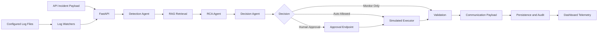

# Architecture

This document describes the architecture that exists in the current source tree.
It intentionally separates implemented, partial, mocked, experimental, planned,
and unavailable capabilities.

## Architecture Inventory

| Area | Files or modules | Purpose | Current status | Documentation gap addressed |
|---|---|---|---|---|
| UI layer | `ui/dashboard.py` | Streamlit operator dashboard that reads API health and dashboard telemetry. | Implemented | README now explains dashboard startup and scope. |
| API layer | `api/main.py`, `api/v1/routers/*` | FastAPI app, versioned API routes, dashboard telemetry, RAG endpoints, MVP routes. | Implemented | API routes are documented in `docs/api_reference.md`. |
| Incident ingestion | `api/v1/routers/incidents.py`, `api/v1/routers/ops_mvp.py`, `scripts/simulate_incident.py` | Accepts API incidents and sample incident payloads. | Implemented | Clarified two API surfaces. |
| Log ingestion | `log_monitors/parsers`, `log_monitors/watchers` | Parses and tails Magento, AEM, Java, and Python logs. | Partial | Requires configured local file paths. |
| Agent pipeline | `agents/*`, `orchestration/__init__.py` | Detection, RCA, decision, remediation, validation, communication. | Implemented with mocked action layer | Remediation limits documented. |
| MVP workflow | `orchestration/langgraph_workflow.py`, `agents/ops_nodes.py` | LangGraph-style AI Ops flow with fallback graph. | Implemented/experimental | Described separately from `/api/v1` pipeline. |
| RAG layer | `rag/indexer`, `rag/retriever`, `services/embedding` | FAISS index, chunking, embeddings, retrieval. | Implemented locally | Embedding model and fallback documented. |
| MVP knowledge layer | `services/aws_knowledge.py` | Local keyword retrieval or optional S3/OpenSearch path. | Partial/experimental | Cloud path described as optional reference. |
| LLM layer | `services/llm`, `services/bedrock_rca.py` | Mock provider, Ollama provider, Bedrock wrapper. | Partial | Missing OpenAI/Anthropic modules noted. |
| Decision layer | `agents/decision`, `agents/ops_nodes.py` | Severity/confidence/risk routing. | Implemented | Status matrix added to README. |
| Approval layer | Incident approval/reject endpoints | Human approval state transitions. | Implemented | Runtime behavior documented. |
| Action layer | `agents/remediation`, `services/mock_integrations.py` | Simulated/dry-run remediation. | Mocked | Clearly marked as not live remediation. |
| Verification layer | `agents/validation` | Deterministic validation checks. | Partial | Live health verification listed as limitation. |
| Persistence | `services/ops_store.py`, `services/incident_store` | Local JSON, optional DynamoDB, optional MongoDB. | Partial | Config docs describe storage modes. |
| Audit/observability | `services/audit_log.py`, `services/observability` | Local/optional audit and runtime telemetry. | Partial | Operations docs explain generated files. |
| Deployment | `Dockerfile`, `docker-compose.yml`, `infra/terraform` | API container and AWS reference infrastructure. | Experimental | Production caveats documented. |

## Runtime View

## Versioned Agent Pipeline

The `/api/v1/incidents/analyze` endpoint runs the async pipeline in
`orchestration/__init__.py`:

1. `IncidentDetectionAgent` normalizes payload metrics and scores severity.
2. `RCAAgent` retrieves context from RAG and generates RCA text through the LLM
   service.
3. `DecisionAgent` applies a severity and confidence matrix.
4. `RemediationAgent` generates a plan and executes it only when policy allows.
5. `ValidationAgent` performs deterministic validation checks.
6. `CommunicationAgent` builds notification/report payloads.
7. Optional MongoDB persistence records pipeline output when MongoDB is enabled
   and reachable.

## AI Ops MVP Workflow

The unversioned `/incidents/trigger` endpoint uses `IncidentWorkflow` in
`orchestration/langgraph_workflow.py`. It attempts to compile a LangGraph state
machine and falls back to an in-process graph when LangGraph is unavailable.

The MVP workflow nodes are:

- `incident_agent`
- `retrieval_agent`
- `rca_agent`
- `decision_agent`
- `approval_agent`
- `mock_remediation_agent`
- `communication_agent`
- `learning_agent`

This workflow stores state in `.local/incident_store.json` by default, or in
DynamoDB when `USE_AWS=true`.

## Implemented Layers

- Streamlit UI
- FastAPI API
- API incident ingestion
- Sample incident ingestion
- Local log file watchers
- Severity scoring
- RAG retrieval
- Mock/Ollama/Bedrock-backed RCA paths
- Decision routing
- Human approval endpoints
- Simulated remediation
- Deterministic validation
- Communication payload generation
- Local JSON/audit persistence
- Optional MongoDB/DynamoDB/S3/OpenSearch reference adapters

## Not Production-Complete

- Live infrastructure remediation.
- Real Slack/Jira/Teams/email delivery.
- Automatic knowledge-base learning from closed incidents.
- Provider modules for OpenAI and Anthropic.
- Strong authentication and authorization.
- Production-grade deployment hardening.
- Full observability integration with external monitoring systems.
